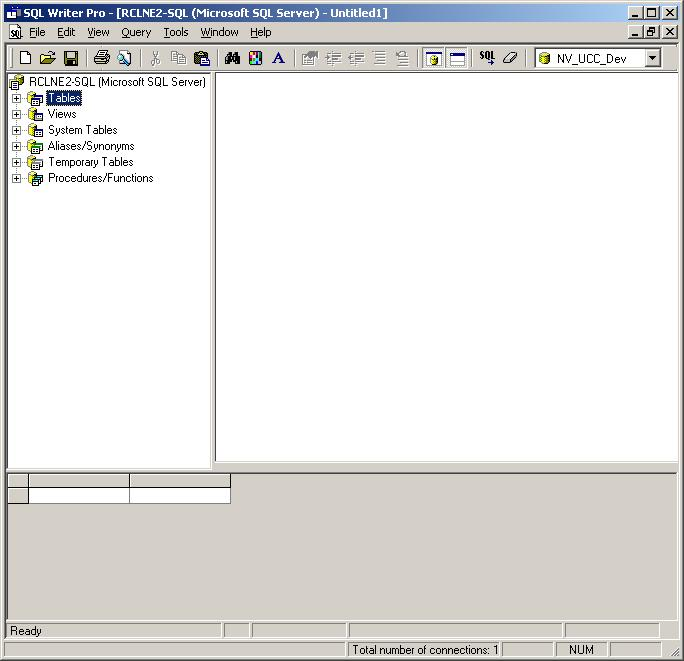



## SQL Writer Pro

### Description

SQL Writer Pro (using ADO) is a Universal Data Access (UDA) tool. It lets you query OLE DB data sources, author SQL scripts and queries, return query results to a grid, retrieve provider properties, execute multiple SQL scripts or stored procedures simultaneously, and more!

This is a work in progress. I ran out of time before being able to complete this application. If you can improve upon it or complete it, please let me know. Otherwise, enjoy!
 
### More Info
 

             |
---                |---
**Submitted On**   |2002-09-20 16:43:32
**By**             |[chabber](https://github.com/Planet-Source-Code/PSCIndex/blob/master/ByAuthor/chabber.md)
**Level**          |Advanced
**User Rating**    |5.0 (35 globes from 7 users)
**Compatibility**  |VB 6\.0
**Category**       |[Databases/ Data Access/ DAO/ ADO](https://github.com/Planet-Source-Code/PSCIndex/blob/master/ByCategory/databases-data-access-dao-ado__1-6.md)
**World**          |[Visual Basic](https://github.com/Planet-Source-Code/PSCIndex/blob/master/ByWorld/visual-basic.md)
**Archive File**   |[SQL\_Writer159722652003\.zip](https://github.com/Planet-Source-Code/chabber-sql-writer-pro__1-45981/archive/master.zip)

